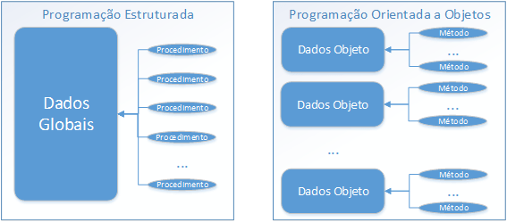

# Diferença entre POO e programação estruturada

A grande diferença entre ambos os paradigmas está na forma como os dados são acessados. Enquanto na programação estruturada eles são acessados de forma global, na programação orientada a objetos eles são estruturados apenas aos objetos que os utilizam.

Com isso ficam acessíveis somente aos seus métodos e não mais acessíveis a todas as funções como no paradigma estruturado.

Com isso o acesso é dado de modo orientado, apesar disso, a estrutura é maleavel já que pode haver troca de dados entre objetos. Com isso o código desenvolvido acaba por ser mais dinamico e a alocação de memória é mais eficiente.

[Próximo capítulo](https://github.com/atomotavio/POO4Noobs/blob/main/3-Pilares-POO/1-Pilares-POO.md)
