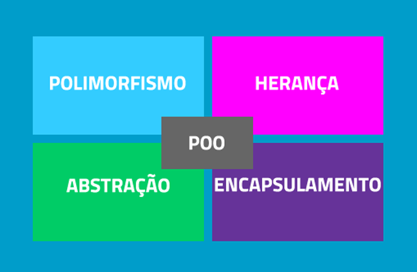

# Pilares da Programação Orientada a Objetos

A POO, possui quatro pilares que a constituem. Nesse capítulo vamos nos aprofundar um pouco mais em cada um. Esses quatro pilares são: a abstração, o encapsulamento, o polimorfismo e a herança. Abaixo vamos conhecer um pouco de cada um deles.

A *abstração* é a habilidade de se concentrar nos aspectos essenciais a um contexto qualquer. No processo da abstração as características menos importantes ou acidentais são desconsideradas.

O *encapsulamento* é um mecanismo que permite proteger todos os métodos e atributos de uma classe. A proteção oferecida pelo encapsulamento é baseada na utilização de modificadores de acesso - mais limitante sobre os atributos aplicados na classe-, disponibilizando métodos internos que modificam os valores dos atributos de classes declaradas.
A partir de modificadores de acesso, o encapsulamento segue para controlar o acesso aos atributos e métodos de uma classe, os atributos podem ser declarados públicos e privados.

- Atributos públicos: podem ser acessados ou modificados por todo objeto que:
    - instância uma classe que contém atributos;
    - utiliza tais atributos.
- Atributos privados: só podem ser acessados ou modificados pelo objeto que está instanciado a classe. O acesso ocorre por meio de um método.

O *polimorfismo* denota uma situação em que o objeto pode comportar-se de maneiras diferentes ao receber uma mensagem. O comportamento do objeto vai depender do modo como ele foi concebido. O polimorfismo é complementado pelos conceitos de herança e sobrecarga de métodos.

*Herança*

Como o próprio nome diz, é a transferencia de caracteristicas de uma classe pai para uma classe filha.

- Herança simples: herança entre duas classes;
- Herança múltipla: quando uma classe herda características de duas ou mais classes-pai;

[Próximo capítulo](https://github.com/jeimoal/POO4Noobs/blob/main/3-Pilares-POO/2-Abstracao.md)
