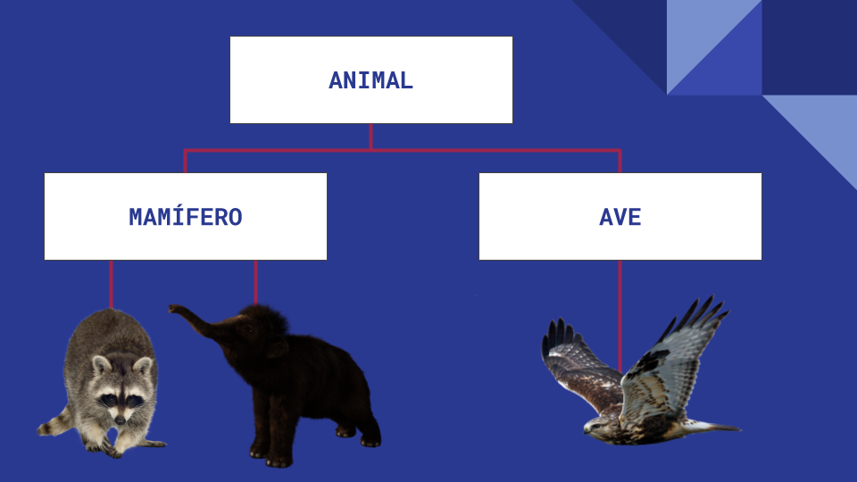

# Herança

Herança, o terceiro pilar da POO, consiste na possibilidade de construir novas classes a partir de classes mais generalistas. É uma maneira de reutilizar código, já que podemos reaproveitar os atributos e métodos de classes já existentes para classes mais específicas dessa classe hierarquicamente superior.

Todo objeto de uma classe construída pelo usuário é também um objeto de outra classe. Em Java por exemplo, existe um objeto de qual todas as classes são originadas: o *object*.

## Superclasses e subclasses

As classes mães, que seriam as mais generalistas, são conhecidas também como superclasses e as classes que derivam dessas superclasses, as subclasses. Essas subclasses nada mais são que classes mais especializadas.

## Herança simples e herança múltipla

No caso de um objeto herdar apenas características de uma superclasse chamamos de herança simples. Porém também é possível que sejam herdadas características de mais de uma classe, a herança múltipla.

~~~Java
// "extends" estabelece a relação de herança dom a classe Carro
public class HondaFit extends Carro {

    public HondaFit(MecanismoAceleracao mecanismoAceleracao) {
        String modelo = "Honda Fit";
        // chama o construtor da classe mãe, ou seja, da classe "Carro"
        super(modelo, mecanismoAceleracao);
    }
}

~~~

~~~PHP
// "extends" estabelece a relação de herança dom a classe Carro
Class HondaFit extends Carro {

    public function HondaFit(mecanismoaceleracao) {
        $modelo = "Honda Fit";
        // chama o construtor da classe mãe, ou seja, da classe "Carro"
    }
}

~~~

[Próximo capítulo](polimorfismo.md)