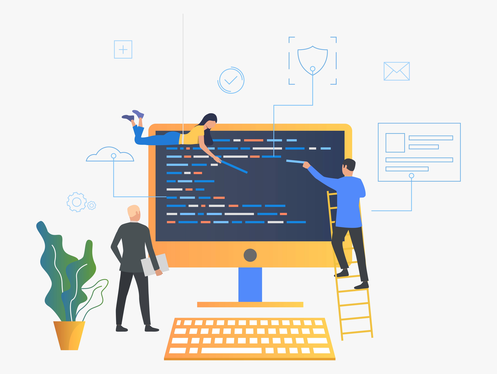

# O que é um paradigma de programação?

Para entendermos o que é a programação orientada a objetos, temos que entender o que são paradigmas de programação, como surgiram e sua importancia.

Paradigmas são modelagens de escrita que código. Eles podem ser aplicados a mais de uma linguagem. Existem linguagens que podem inclusive aceitar mais de um tipo de paradigma, como o Javascript por exemplo.

Ele seria como uma fórmula para construir a resolução de um problema. Ou seja, voce precisa fazer um bolo, cada receita tem a sua forma de preparo (o paradigma), algumas mais complicadas, outras mais fáceis, umas levarão mais ingredientes, outras menos tempo, mas todas vão te dar um bolo no final.

## Por que devemos aprender um paradigma?

Apesar de todas as receitas de bolo te ensinarem a mesma coisa, cada uma tem seu modo de preparo certo? E cada receita vai atender uma particularidade, seja o tempo de preparo que é pequeno, talvez voce seja intolerante a lactose e precise de uma receita especial. O mesmo vale para os paradigmas de programação, cada um possui suas particularidades e vai ser mais eficiente para determinado tipo de problema a ser resolvido.

Existem diversos paradigmas de programação, e se quiser saber um pouco mais sobre os principais, pode clicar [aqui](https://blog.betrybe.com/tecnologia/paradigmas-de-programacao/). No próximo capitulo falaremos um pouco sobre o paradigma procedural e suas diferenças com relação ao POO, que é o foco desse 4Noobs.

[Próximo capítulo](historia.md)