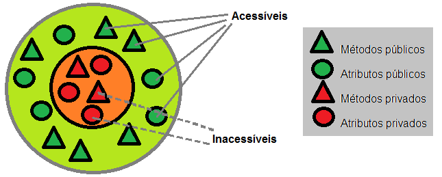

# Encapsulamento

Para evitar o acesso a dados de forma indevida e evitar principalemente problemas relacionados a segurança, temos o segundo pilar da POO.

Um exemplo disso seria por exemplo o saldo no banco. Se um usuário comum tiver acesso a esse dado e conseguir alterá-lo, poderia criar um problema enorme para a instituiçào, uma vez que ele pode colocar o saldo que quiser para si mesmo. Por isso é importante proteger a informação sensível.

## Níveis de acesso

Os níveis de acesso servem para definir o tipo de permissão a um determinado atributo. Podem existir 3 níveis:
- Público: todas as classes do programa tem acesso aos dados e métodos livremente.
- Protegido: somente classes derivadas da original tem total acesso aos atributos e métodos.
- Private: o acesso aos dados é feito somente dentro da classe onde ele foi declarado.

<!-- TODO colocar link -->
[Próximo capítulo]()